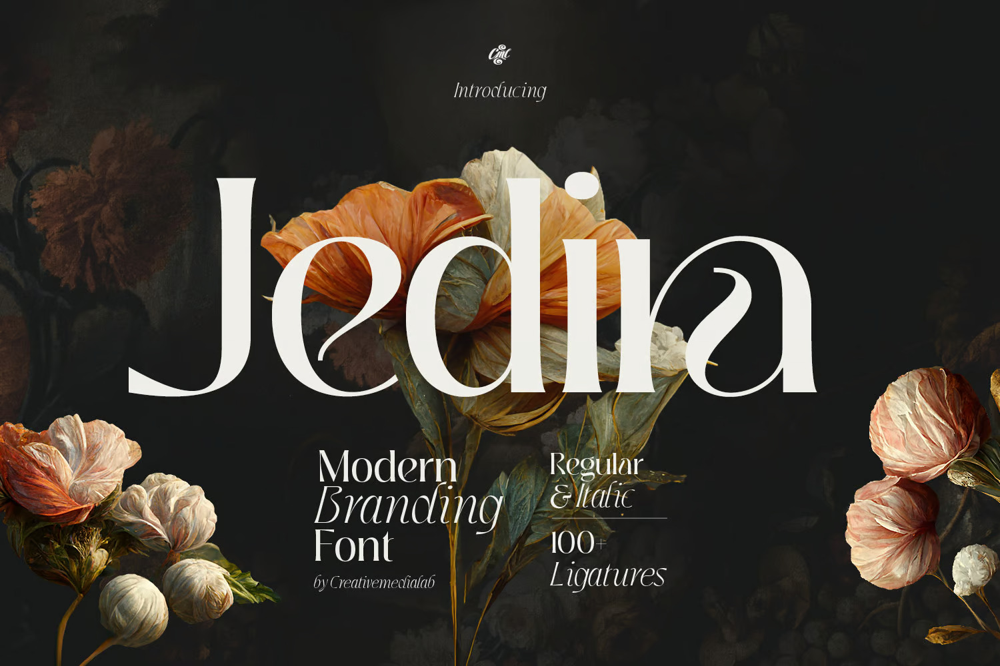

# Modern Brand Logo Font - Jedira



**Jedira** is a modern, stylish, and versatile typeface designed specifically for branding, logos, and creative design projects. Its sleek, geometric structure makes it perfect for high-end brands, tech companies, and minimalistic designs.

## Features
- **Elegant & Modern**: Clean, sharp, and contemporary font design.
- **High Readability**: Well-balanced letterforms optimized for digital and print.
- **Versatile Use**: Suitable for branding, logos, posters, packaging, and more.
- **Multiple Weights**: Includes Regular, Bold, and Italic variations.
- **Supports Multiple Languages**: Covers Latin-based characters and accents.

## Installation
1. Download the font files from the [Releases](https://github.com/NarendraYSF/Modern-Brand-Logo-Font-Jedira/releases).
2. Extract the ZIP file.
3. Install the font by:
   - **Windows**: Right-click the `.ttf` or `.otf` file and select *Install*.
   - **Mac**: Double-click the file and click *Install Font*.
   - **Linux**: Move the font files to `~/.fonts` or `/usr/share/fonts`.

## Usage
To use the **Jedira** font in your CSS, add the following snippet:
```css
@font-face {
    font-family: 'Jedira';
    src: url('path-to-font/Jedira-Regular.ttf') format('truetype');
    font-weight: normal;
    font-style: normal;
}

body {
    font-family: 'Jedira', sans-serif;
}
```

## Preview
```plaintext
JEDIRA
Modern & Stylish Typeface
```

## License
This font is licensed under the [Your Chosen License](LICENSE). Please review the terms before using it commercially.

## Contribution
We welcome contributions! Feel free to:
- Report issues
- Suggest new features
- Improve font styles

Fork the repository and submit a pull request!

## Connect
🔗 **Portfolio:** [mywebsite.com](https://narendra-blog.netlify.app/)  
📩 **Email:** rendra.narendrayusuf@gmail.com

---
**Jedira** - Designed for Modern Brands & Creators 🚀
